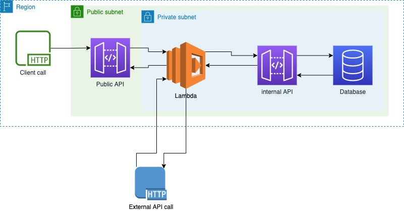

###First task

We have an issue related to our application load because of the huge amount of HTTP requests it receives. Those requests could be potentially processed asynchronously, as the client doesn't care about the response from our API gateway endpoint. Having that in mind, we decided to improve our application architecture by integrating a queue into the current system.

You need to help us to build a new architecture design, where we will have a queue for collecting the requests, and a PHP application for consuming the messages from that queue. We need to make sure the application is consuming messages correctly and keeps track of errors. Sometimes there might be a timeout and then, after 1 minute, the same request would work again. Please write down a way of handling such cases.

From the consumer perspective, you should expect `GET` requests to an external API and a `POST` request to our internal API.

The architecture should be based on cloud services, be resilient and performant.

Please, provide the architecture design as a diagram. You can include the image directly, or a shareable link to diagrams.net or other preferred service.

Include a description of the architecture, and explain the motivations behind the choices made.

### Second task

The command `banned-users:get` in the Laravel project in this repository has been poorly implemented. 
There are several problems with the code quality, and the stakeholders reported that it also doesn't always output the correct results.

Its target is to get all the users that have been banned from the platform.
It must accept some parameters:
- `--no-admin`, get all the users that have been banned and have no related `admin` role;
- `--admin-only`, get all the users that have been banned and have related `admin` role;
- `--active-users-only`, get all the users that have been banned and that have been activated;
- `--with-trashed`, get all the users that have been banned and that have been both deleted or not;
- `--trashed-only`, get all the users that have been banned and that have been both deleted;
- `--with-headers`, if set, print and save the column headers too;
- `sort-by={field-name}` (optional), the field on which sort the output;
- `save-to={output/file/absolute/path}`, if set, save the list on output file too.

It must output a list of sorted users, each one in a new line, indicating users' `email`, `id` and the date of the ban.

You are required to:

1. Identify and correct all problems in the current source code.
2. Improve the coding style and make it compliant with the PSR guidelines.
3. Refactor the logic in the command to use services or helpers according to Laravel best practices.
4. Write unit tests for all the code you will implement.

Consider matching at least a 90% lines of code coverage. If you think it's not possible to reach it, please explain why.

